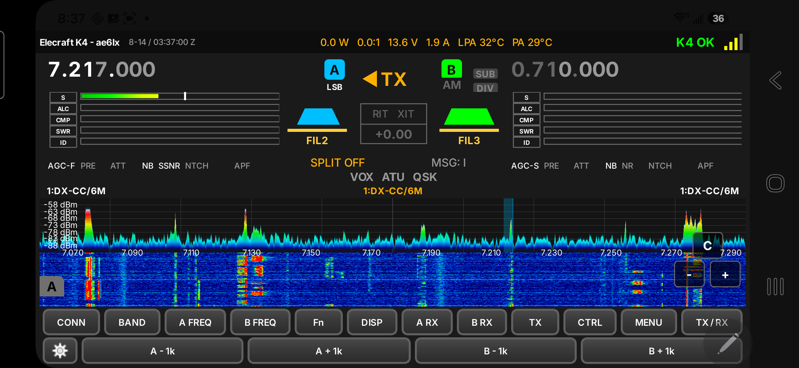
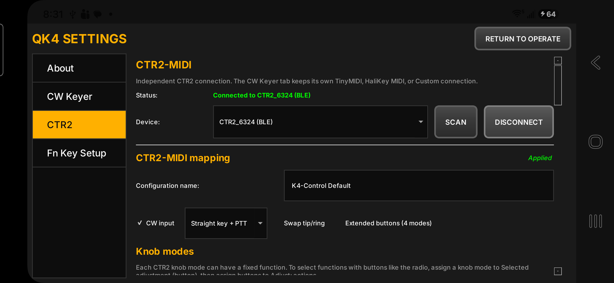
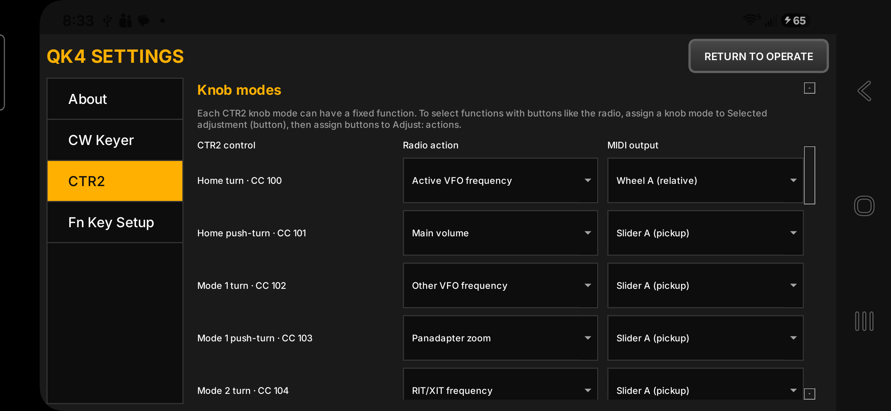
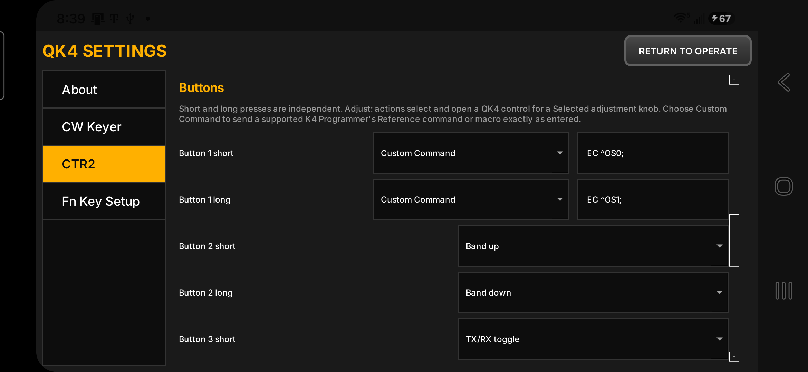
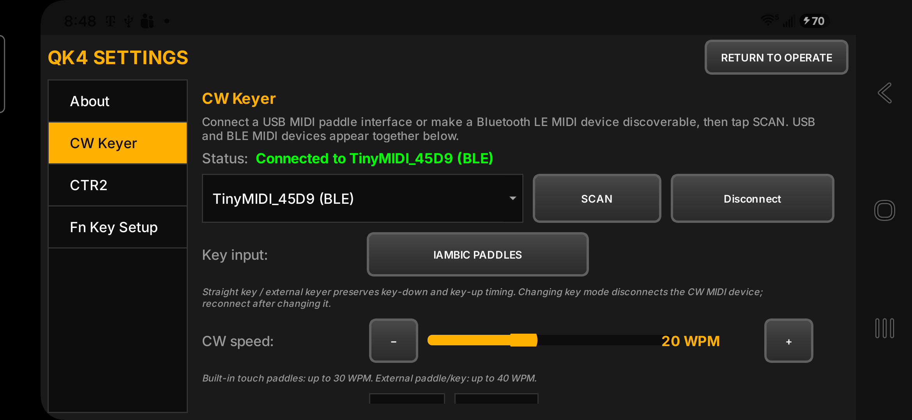
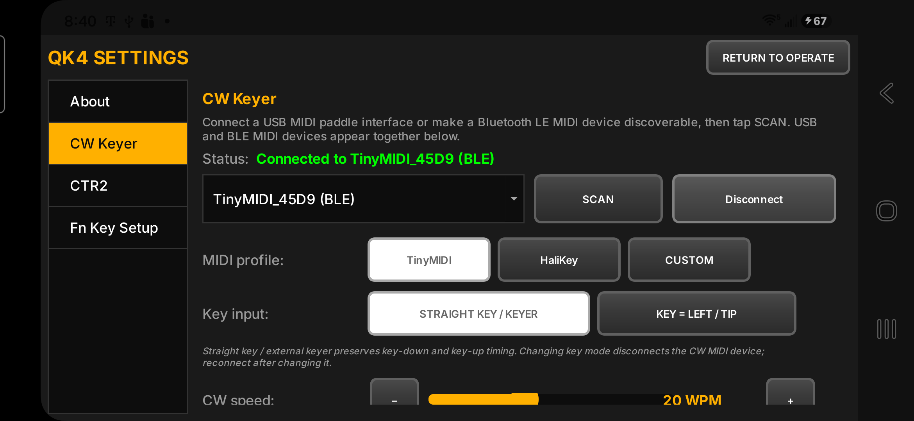
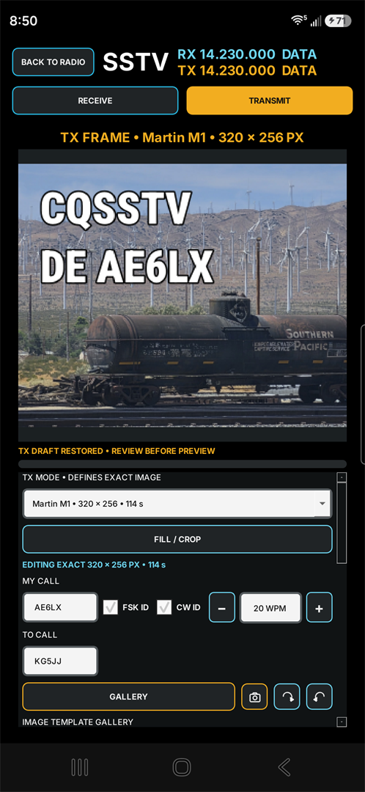

# QK4 Android

QK4 Android is a phone-focused Android client for Elecraft K4 transceivers. It preserves the proven radio-control, TCP/TLS, panadapter-stream, and TX/RX audio architecture of QK4 while replacing its desktop-oriented interaction model with a landscape touch interface.

The application is under active development and is intended for use with an
Elecraft K4/K4D on the same network. Version 1.0.5 is the current ARM64
release.



## Project lineage

QK4 Android is a derivative of [QK4](https://github.com/mikeg-dal/QK4), created by Mike Garcia, KF5O. Android development and phone UX adaptation are by [worldwideDX.com](https://worldwidedx.com/).

Android tablet and iOS development is contributed by [Fred Klassen](https://github.com/tcpreplay-dev).

This repository retains the GNU General Public License v3 used by the upstream project. See [LICENSE](LICENSE).

## Current capabilities

QK4 Mobile supports every known operator-facing capability that the K4 exposes
for remote operation through its documented command, control, display, and
streaming interfaces. Functions that Elecraft has not implemented or exposed
to remote clients, such as BAND/MEM, remain outside the application's control.

- K4 profile management and TCP/TLS connection
- RX audio streaming for the main and sub receivers
- Microphone audio and PTT transmission
- Remote CW keying from Bluetooth LE and USB MIDI interfaces, including
  paddles, straight keys, and external keyers with TinyMIDI, HaliKey MIDI,
  CTR2-MIDI, and learnable custom MIDI mappings
- K4-synchronized paddle orientation, Iambic mode, keying weight, CW speed,
  local sidetone, and key testing
- Independent CW Keyer and CTR2-MIDI connections, allowing two USB/BLE MIDI
  devices to remain available at the same time
- User-configurable CTR2 knob modes and independent short/long button actions,
  including predefined radio controls and exact K4 programmer commands
- User-accessible save/load files for complete CTR2 mappings and F1-F8 FN-key
  configurations
- USB-C headset RX/TX hot-swap, plus Bluetooth/USB mixed-route support where Android provides it
- Android hearing-aid RX routing when the operating system exposes a dedicated hearing-aid output
- VFO A/B display, tuning, direct frequency entry, and selectable tuning steps
- GEN shortwave-listening band bank with persistent per-band frequency recall
- Touch tuning from the panadapter
- Spectrum and waterfall display, including mini-pan
- Mode-aware Main RX, Sub RX, TX, radio-control, display, function, and message controls
- FM repeater shift/offset, PL tone, and programmable DTMF controls
- RIT/XIT jog control
- CW text decoding
- F1-F8 macro editing and execution
- Integrated SSTV transmit and receive with 22 modes, image composition,
  templates, automatic reception, callsign identification, and RX history
- Touch-scrollable DX prefix reference with natural alphanumeric sorting and prefix/country search
- Android landscape layout and touch-safe scrolling
- Local non-decaying Peak Hold and local WTR CLRS waterfall brightness control
- Release-signed APK distribution support

See the [v1.0.5 release notes](docs/RELEASE_NOTES_v1.0.5.md) and
[project status](docs/PROJECT_STATUS.md) for the verified state and next work.
Contributors changing screen rotation or device-class layouts must also follow
the [screen orientation policy](docs/ORIENTATION_POLICY.md).

## FT8 and FT4

QK4 Mobile receives and decodes FT8 and FT4 from the K4 Main RX audio stream
and supports standard timed Call and CQ exchanges. Signal reports are measured
automatically using the WSJT-X method. The phone interface provides a live
spectrum and waterfall, independent RX and TX audio-frequency selection,
received-traffic and My QSO views, common working frequencies, custom frequency
entry, RF power control, and CTR2-MIDI tone adjustment.

<p align="center">
  
</p>

<p align="center"><em>QK4 Mobile v1.0.5 completing an FT4 QSO with DJ6OI at 14.080 MHz, including measured reports, RR73, live spectrum/waterfall, TX protection, and integrated logging.</em></p>

Opening FT8/FT4 selects DATA-A. The module keeps DATA-A active while changing
bands and restores the operator's previous radio mode when returning to the
main console. FT8/FT4 uses portrait orientation on phones.

For CTR2-MIDI control, assign one user-selected button to **FT8/FT4: Switch
RX/TX tone** for short press and **FT8/FT4: Set tone frequency** for long press.
Assign the wheel to **Selected adjustment (button)**. Short press selects the RX
or TX tone, the wheel moves its dashed preview marker, and long press sets the
frequency. Setting RX focuses **My QSO**; setting TX enables **Hold TX**. See
[FT8/FT4 scope](docs/FT8_FT4_SCOPE.md) and
[CTR2 controls](docs/CTR2_UI_ACTIONS.md).

## Logbook and QRZ

The shared ADIF logbook is available throughout QK4 Mobile:

- Completed FT8/FT4 contacts can be reviewed and logged from the digital-mode
  screen.
- SSTV Receive and Transmit provide **Log QSO** with an editable callsign review.
- Long-press **DXLIST** to open the logbook from the main radio console.
- Add and edit contacts manually, search the log, and import or export ADIF.
- Configure automatic QRZ Logbook uploads or manually send an unsent contact.

QRZ credentials are stored in Android Keystore-encrypted storage. Each contact
shows whether QRZ confirmed its upload, and exported ADIF includes the standard
QRZ upload status and date fields. See [QRZ Logbook](docs/QRZ_LOGBOOK.md).

## Digital-mode TX calibration

FT8 and FT4 share one TX audio calibration for a given radio and audio-input
setup. SSTV uses its own calibration. Calibration runs with the K4 in TEST mode,
adjusts the program-audio drive to an appropriate ALC level, and remembers the
result for later transmissions.

During digital transmission, QK4 Mobile monitors K4 metering and audio headroom.
It can reduce drive or stop transmission when the measured conditions are not
safe or required feedback is unavailable. See
[digital transmit levels](docs/DIGITAL_TX_LEVEL.md).

## MIDI hardware, straight keys, and CTR2-MIDI

QK4 Mobile provides two independent MIDI device roles. The **CW Keyer** role
supports TinyMIDI, HaliKey MIDI, and learnable custom devices. The dedicated
**CTR2** role connects separately, so an operator can, for example, use a
TinyMIDI for paddles or a straight key while using CTR2-MIDI for its knob and
buttons. Both roles discover USB MIDI and Bluetooth LE MIDI devices, remember
their own selected endpoint, and can contribute CW input without one device
disabling the other.

### CTR2 connection and key input

The CTR2 page contains its own connection controls and starts with the
K4-Control-compatible default mapping. CTR2 key input can be disabled or set
for paddles, or for a straight key/external keyer plus PTT. Normal and extended
CTR2 button layouts are supported; the QK4 selection must match the Extended
BTN setting on the CTR2 itself.



### CTR2 knob modes

Each of the eight CTR2 knob messages, CC100 through CC107, can be assigned to a
predefined QK4 radio control. The supplied Map 1 defaults retain CTR2's native
MIDI formats: CC100 uses speed-sensitive **Wheel A**, while CC101 through CC107
use **Slider A** output. The output selection describes the MIDI format emitted
by CTR2; it is not chosen according to whether the QK4 control is drawn as a
knob or slider.

Available actions include active and other VFO tuning, main/sub volume and RF
gain, filter bandwidth and shift, RIT/XIT, NR and NB level, squelch, RF power,
CW speed, panadapter zoom and reference level, and local waterfall brightness.
A knob assigned to **Selected adjustment (button)** behaves like a radio
multi-function control: a button assigned to an **Adjust:** action selects the
function, opens the corresponding QK4 adjustment control when one exists, and
the knob then changes that setting.

See [CTR2-MIDI on-screen controls and feedback](docs/CTR2_UI_ACTIONS.md) for
the complete list of adjustment surfaces, operating-display updates, and
immediate button actions.



### CTR2 buttons and mapping files

Short and long presses are separate assignments. A button can invoke a
predefined function such as Band up/down, Rate, KHZ, TX/RX toggle, or an
**Adjust:** action. It can instead send a supported K4 Programmer's Reference
command or command sequence exactly as entered; QK4 does not invent or merge a
separate macro language.

In Normal Button Mode, the same 12 short/long assignments work in every knob
mode. Enabling Extended Button Mode retains those assignments under **Home**
and exposes 36 additional assignments for Knob modes 1–3, initially set to
**Disabled**. QK4 does not duplicate the Home actions into the new modes. The
checkbox must match the CTR2's own Extended BTN setting.

For a knob configured to emit directional MIDI Button notes, QK4 uses notes
40–55 in Normal Button Mode and notes 60–75 in Extended Button Mode. This keeps
extended physical-button notes 40–48 available for their documented actions.



Complete CTR2 configurations can be saved to and loaded from user-accessible
`.qk4ctr2map` files. Loading replaces the complete mapping rather than merging
it. QK4 prompts to apply or abandon pending edits before leaving the setup
screen, and prompts about saving only when a load would replace unsaved
changes. Exported files document the accepted action and output keywords,
including when to use Wheel, Slider, or directional Button formats. Every
button entry identifies its physical label, MIDI note, press type, knob mode,
and assigned action or macro. See the
[sample CTR2 mapping](docs/QK4-CTR2-Rate-KHZ-Sample.qk4ctr2map).

The separate **Fn Key Setup** page can likewise save or load all F1-F8 labels
and K4 command strings in a user-editable `.qk4fnmap` file.

### Iambic paddle, straight-key, and external-keyer support

The CW Keyer role supports Iambic paddles with the established orientation,
Iambic mode, weight, speed, local sidetone, and test controls. TinyMIDI,
HaliKey MIDI, and learnable custom devices can connect over USB MIDI or
Bluetooth LE MIDI.



TinyMIDI, HaliKey MIDI, custom MIDI devices, and CTR2-MIDI can also be
configured for straight-key or external-keyer input. QK4 preserves each
key-down and key-up transition and generates the local sidetone; the K4's
delayed monitor audio is not required.



## Supported target

| Item | Current development target |
|---|---|
| Platform | Android 8.0 (API 26) or later |
| ABI | ARM64 (`arm64-v8a`) |
| Android package | `com.w9wdx.qk4phone` |
| UI | Landscape touch UI; the compact phone layout is temporarily used on all display sizes, including tablets |
| Framework | Qt 6.11.1 |
| Android API | Minimum 26, target 34 |
| Radio | Elecraft K4/K4D |

Other platforms remain present in the inherited QK4 source, but this repository's supported product target is Android. Physical acceptance testing has been performed on a Samsung Galaxy S26 Ultra; test other phone families before treating them as validated.

## Integrated SSTV

QK4 Mobile receives and transmits all 22 supported SSTV modes directly through
the K4 network-audio path. Automatic receive includes progressive decoding,
mode detection, slant correction, callsign identification, and retained image
history. The transmit workspace provides exact mode-sized composition,
gallery/camera sources, crop and positioning, reusable templates, text and
markup, preview, and optional post-image FSK and CW identification. Transmit
uses deliberate phone PTT, program audio, and automatic return to receive.



## Recommended K4 operating settings

These settings are practical starting points for remote operation and SSTV.
Band conditions, interference, antenna performance, and individual
installations may require different settings.

### SSTV receive

- Use **AGC-F** as the normal starting point. If rapid gain changes or pumping
  appear to degrade reception, compare results with **AGC-S**.
- Enable **K4 RX Auto Attenuation**. This allows the K4 to reduce analog
  front-end gain automatically when exceptionally strong signals threaten
  receiver dynamic range. It complements AGC-F; AGC and RF gain operate later
  and cannot correct front-end overload.
- Leave the preamp off unless it produces a genuine weak-signal improvement.
  On noisy HF bands, extra preamp gain often raises both signal and noise
  without improving decoding.
- Use a receive passband wide enough to preserve the complete SSTV tone range,
  approximately **1200-2300 Hz**, with reasonable margin on both sides.
- Avoid filter shift settings that cut off the lower synchronization tones or
  upper image tones.
- Start with **NB, NR, SSNR, manual notch, and APF off**. Add processing only
  when it improves actual image decoding.
- Use **NB** for repetitive impulse noise and select the lowest effective
  level. Aggressive blanking can distort SSTV tones or create artifacts when
  strong signals are nearby.
- Use **NR or SSNR selectively** for difficult signals. Compare reception with
  processing on and off; a signal that sounds cleaner to the ear does not
  necessarily decode better.
- Rear-panel analog **LINE OUT** levels do not control the network audio stream
  used by QK4 Mobile.

### SSTV transmit

- Prefer the K4's **DATA** mode for SSTV transmission. It provides a clean
  audio-data path without speech compression.
- **USB** may also be used when compression is set to zero and TX EQ is flat.
- Do not use speech processing, aggressive transmit EQ, or other voice
  enhancement on SSTV tones.
- Use only the RF power needed for reliable communication and account for the
  high duty cycle of SSTV transmissions.
- Confirm transmission quality with an independent receiver, WebSDR recording,
  or another SSTV decoder when initially configuring the station.

See the
[Elecraft K4 Operating Manual](https://ftp.elecraft.com/K4/Manuals%20Downloads/K4%20Built-In%20Operating%20Manual%20rev%20D6/K4BuiltInOperatingManualrevD6.html)
for detailed descriptions of AGC, attenuation, preamplifiers, noise blanking,
noise reduction, filtering, and DATA-mode operation.

## Build on Windows

Install:

- Qt 6.11.1 with the Android ARM64 kit and a matching Windows desktop host kit
- Android SDK, platform tools, and NDK
- Android Studio's bundled Java runtime or another compatible JDK
- CMake and Ninja, normally installed by the Qt Maintenance Tool

The ARM64 Opus headers and static library used by the current Android build are kept under `third_party/android/opus` so the repository does not depend on the original development PC's directory layout.

From PowerShell or Command Prompt:

```powershell
build-android.cmd -Action Doctor
build-android.cmd -Action Configure
build-android.cmd -Action Apk
test-windows.cmd -Action Test
```

To make a distribution APK, use the external release keystore and the
temporary signing environment variables documented in
[docs/BUILD_ANDROID_WINDOWS.md](docs/BUILD_ANDROID_WINDOWS.md):

```powershell
build-android.cmd -Action Apk -DeploymentType Release
```

To install on a connected phone with USB debugging enabled:

```powershell
build-android.cmd -Action Install
```

Development phones that still contain the former `com.ai5qk.qk4phone` debug
package can migrate its private QK4 settings and SSTV data once before the old
package is removed. Follow the guarded procedure in
[docs/BUILD_ANDROID_WINDOWS.md](docs/BUILD_ANDROID_WINDOWS.md); the migration
utility verifies every copied file before it permits removal.

The script discovers normal Qt and Android SDK locations. Any nonstandard location can be supplied through these environment variables:

| Variable | Purpose |
|---|---|
| `QK4_QT_ANDROID` | Qt Android ARM64 kit directory |
| `QK4_QT_HOST` | Matching Qt Windows host kit directory |
| `ANDROID_SDK_ROOT` | Android SDK directory |
| `ANDROID_NDK_ROOT` | Android NDK directory |
| `QK4_JAVA_HOME` | Preferred JDK directory for this build |
| `JAVA_HOME` | Fallback JDK directory |
| `QK4_CMAKE` | Full path to `cmake.exe` |
| `QK4_NINJA` | Full path to `ninja.exe` |
| `QK4_OPUS_ROOT` | Alternate Android Opus installation |

Detailed setup and troubleshooting are in [docs/BUILD_ANDROID_WINDOWS.md](docs/BUILD_ANDROID_WINDOWS.md).
For a transfer checklist, including what is intentionally *not* stored in Git, see [docs/PORTABILITY.md](docs/PORTABILITY.md).

## Source layout

```text
android/                  Android manifest, Gradle configuration, and icons
scripts/                  Guarded development and migration utilities
src/audio/                Opus and Qt audio engine
src/controllers/          UI and radio orchestration
src/dsp/                  Spectrum, panadapter, and waterfall rendering
src/models/               K4 state and CAT response handling
src/network/              TCP/TLS and K4 streaming protocol
src/settings/             Local application settings
src/ui/                   Shared and Android-adapted widgets
third_party/android/opus/ ARM64 Android Opus development files
.codex/skills/            Repository-local Codex development skill
```

## Security and local data

Radio profiles and passwords are runtime data and are not stored in this repository. Do not commit profile exports, logs containing credentials, keystores, signing passwords, APKs, build trees, or phone screen captures.

Production distribution requires a private Android signing key. Keep signing credentials outside the repository and provide them only through the supported build environment.

## Development guidance

Read [AGENTS.md](AGENTS.md) before making changes. The central rule is to preserve QK4's known-good connection, audio, and radio-control methods. Android work should adapt presentation and input behavior without inventing alternate radio plumbing.
